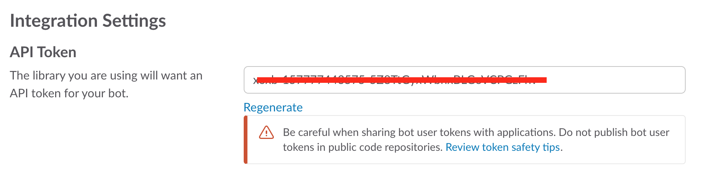

[](https://travis-ci.org/IBM/watson-online-store)


# Criando um chatbot de varejo usando os serviços Watson Assistant, Discovery e Database
*Ler em outros idiomas: [Inglês](README.md), [한국어](README_ko.md)*
Nesta jornada do desenvolvedor, criaremos um chatbot baseado no Watson Assistant que ajuda o usuário a: 1) localizar itens para comprar usando o Watson Discovery e 2) adicionar e remover itens do carrinho atualizando um banco de dados NoSQL do Cloudant.
Após concluir esta jornada, o leitor saberá como:
* Criar um diálogo do chatbot com o Watson Assistant
* Armazenar e atualizar dinamicamente um banco de dados NoSQL do Cloudant com base nos resultados do chatbot
* Enviar dados para o Watson Discovery e utilizar seus recursos de linguagem natural
* Gerenciar e personalizar um grupo do Slack para incluir um chatbot


### With Watson
Deseja levar seu aplicativo do Watson ao próximo nível? Quer aproveitar os ativos da marca Watson? Participe do programa [With Watson](https://www.ibm.com/watson/with-watson), que oferece recursos técnicos, de marketing e da marca exclusivos para amplificar e acelerar sua solução comercial incorporada do Watson.

## Componentes inclusos
- IBM Watson Assistant
- IBM Watson Discovery
- Banco de dados NoSQL IBM Cloudant
- Slack
- Python

# Assista ao vídeo
[](https://youtu.be/b-94B3O1czU)

# Etapas
**OBSERVAÇÃO:** realize as etapas de 1 a 7 **OU** clique no botão ``Deploy to Bluemix`` e pressione ``Deploy`` e, a seguir, avance para a etapa 6. &gt; Como não há uma interface com o usuário da web (somente o Slack), não use o botão ``View app`` para ver o aplicativo. Utilize o painel do Bluemix para localizar e gerenciar o aplicativo. Use sua interface com o usuário do Slack para conversar.
[](https://bluemix.net/deploy?repository=https://github.com/IBM/watson-online-store&amp;cm_mmc=github-code-_-native-_-retailchatbot-_-deploy2bluemix)
1. [Clonar o repositório](#1-clone-the-repo)
2. [Criar serviços do Bluemix](#2-create-bluemix-services)
3. [Obter credenciais do Bluemix e incluir em .env](#3-get-creds-add-to-.env)
4. [Configurar o Watson Assistant](#4-configure-watson-conversation)
5. [Configurar o Watson Discovery](#5-configure-watson-discovery)
6. [Configurar o Slack](#6-configure-slack)
7. [Executar o aplicativo](#7-run-the-application)

## 1. Clonar o repositório Clone o `watson-online-store` localmente.
Em um terminal, execute `$ git clone https://github.com/ibm/watson-online-store`. Utilizaremos o arquivo [`data/workspace.json`](data/workspace.json) e a pasta [`data/ibm_store_html/`](data/ibm_store_html)

## 2. Criar serviços do Bluemix Crie os serviços a seguir:
* [**Watson Assistant**](https://console.ng.bluemix.net/catalog/services/conversation)
* [**Watson Discovery**](https://console.ng.bluemix.net/catalog/services/discovery)
* [**Banco de dados NoSQL do Cloudant**](https://console.ng.bluemix.net/catalog/services/cloudant-nosql-db/)

## 3. Obter as credenciais de serviços do Bluemix e incluir no arquivo .env
Enquanto cria os serviços do Bluemix, você precisará criar credenciais de serviços e obter o nome do usuário e a senha:

<p align="center">

</p>

Mova o arquivo watson-online-store/env.sample para /.env e preencha as credenciais de serviço (e a URL do Cloudant) enquanto cria as credenciais:

```
# Watson conversation CONVERSATION_USERNAME=<add_conversation_username>
CONVERSATION_PASSWORD=<add_conversation_password>
WORKSPACE_ID=<add_conversation_workspace>

# Cloudant DB CLOUDANT_USERNAME=<add_cloudant_username>
CLOUDANT_PASSWORD=<add_cloudant_password>
CLOUDANT_DB_NAME=watson_online_store CLOUDANT_URL=<add_cloudant_url>

# Watson Discovery DISCOVERY_USERNAME=<add_discovery_username>
DISCOVERY_PASSWORD=<add_discovery_password>
DISCOVERY_ENVIRONMENT_ID=<add_discovery_environment>
DISCOVERY_COLLECTION_ID=<add_discovery_collection>

# Slack SLACK_BOT_TOKEN=<add_slack_bot_token>
SLACK_BOT_USER=wos
```
## 4. Configurar o Watson Assistant

Acione a ferramenta **Watson Assistant**. Use o botão com o ícone de **importação** à direita

<p align="center">

</p>

Localize a versão local de [`data/workspace.json`](data/workspace.json) e selecione **Import**. Para localizar o **ID da área de trabalho**, clique no menu de contexto da nova área de trabalho e selecione **View details**.

<p align="center">

</p>

Insira o ID da área de trabalho no arquivo .env como WORKSPACE_ID.

*Como opção*, para visualizar o diálogo do Assistant, selecione a área de trabalho e escolha a guia **Dialog**.
Este é um fragmento do diálogo: 

## 5. Configurar o Watson Discovery Acione a ferramenta **Watson Discovery**.
Quando fizer isso pela primeira vez, você verá “Before working with private data, we will need to set up your storage”. Clique em “Continue” e aguarde a configuração do armazenamento. Crie uma **nova coleção de dados** e atribua um nome exclusivo para ela.

<p align="center">

</p>

Para enviar o conteúdo, selecione **Add data to this collection** no diálogo e escolha os arquivos HTML em [`data/ibm_store_html/`](data/ibm_store_html). Depois de concluir, inclua **environment_id** e **collection_id** no arquivo .env como DISCOVERY_ENVIRONMENT_ID e DISCOVERY_COLLECTION_ID.

<p align="center">

</p>

## 6. Configurar o Slack
[Crie um grupo do Slack](https://slack.com/create) ou utilize um existente se tiver autorização suficiente. (Consulte as [instruções do Slack](https://get.slack.help/hc/en-us/articles/206845317-Create-a-Slack-team) sobre a criação de novos grupos.) Para incluir um novo bot, acesse as configurações do aplicativo do grupo do Slack navegando até `https://<slack_group>.slack.com/apps/manage` e selecionando o menu **Custom Integrations** à esquerda.

Clique em “Bots” e, em seguida, clique no botão verde “Add Configuration”.
Dê um nome significativo para o bot. Observe que o símbolo “@” foi preenchido previamente pelo Slack e não é incluído no arquivo de configuração .env. Salve-o no .env como SLACK_BOT_USER.

<p align="center">

</p>

Após a criação, salve o **token da API** gerado no arquivo .env como SLACK_BOT_TOKEN em caso de execução local ou salve se estiver usando o Deploy to Bluemix.

Execute `/invite <botame>` em um canal para convidar o bot ou envie uma mensagem diretamente.

<p align="center">

</p>

## 7. Executar o aplicativo

### Se você usou o botão Deploy to Bluemix...
Se você usou ``Deploy to Bluemix``, a maior parte da configuração será automática, mas não em sua totalidade. Precisamos atualizar algumas variáveis de ambiente. No painel do Bluemix, localize o aplicativo que foi criado. Clique em ``Runtime`` no menu e navegue até a guia ``Environment variables``.

Atualize as três variáveis de ambiente:
* Defina ``SLACK_BOT_TOKEN`` como o token que foi salvo na Etapa 6
* Defina ``SLACK_BOT_USER`` como o nome do seu bot da Etapa 6
* Deixe ``CLOUDANT_DB_NAME`` definido como ``watson-online-store`` Salve os novos valores e reinicie o aplicativo; procure erros nos logs.

### Se decidiu executar o aplicativo localmente...
``` $ python run.py ```

# Saída de amostra
Inicie uma conversa com seu bot:


Inclua um item no seu carrinho:


# Resolução de Problemas
* Ajuda! Encontrei erros no meu log ao usar o Deploy to Bluemix
Isto é esperado durante a primeira execução. O aplicativo tenta iniciar antes de o serviço Discovery ser totalmente criado. Aguarde um ou dois minutos. Esta mensagem deve aparecer:
``Watson Online Store bot is connected and running!``
* É exibida uma grande quantidade de informações de Criação de Log Vermelho.

Isto é esperado. A cor da criação de log no Bluemix será vermelha, independentemente da natureza da mensagem. Os níveis de log são definidos como “Debug” para auxiliar o desenvolvedor a ver como o código está sendo executado.
Isso pode ser alterado para ``logging.WARN`` ou ``logging.ERROR`` no [código python](https://github.com/IBM/watson-online-store/blob/master/watsononlinestore/watson_online_store.py#L22).

# Licença
[Apache 2.0](LICENÇA)

# Aviso de Privacidade
Se usar o botão Deploy to Bluemix, algumas métricas serão acompanhadas e as informações a seguir serão enviadas a um serviço de [Rastreador da Implementação](https://github.com/IBM-Bluemix/cf-deployment-tracker-service) em cada implementação:
* Versão do pacote do Python
* URL do repositório do Python
* Nome do Aplicativo (application_name)
* GUID do Aplicativo (application_id)
* Número de índice da instância do aplicativo (instance_index)
* ID do Espaço (space_id)
* Versão do Aplicativo (application_version)
* URIs do Aplicativo (application_uris)
* Etiquetas dos serviços de limite
* Número de instâncias para cada serviço de limite e informações do plano associado

Esses dados são coletados do arquivo setup.py no aplicativo de amostra e das variáveis de ambiente ``VCAP_APPLICATION`` e ``VCAP_SERVICES`` no IBM Bluemix e em outras plataformas do Cloud Foundry. Esses dados são utilizados pela IBM para o acompanhamento de métricas a respeito de implementações dos mesmos aplicativos no IBM Bluemix. O objetivo é determinar a utilidade dos nossos exemplos para podermos melhorar continuamente o conteúdo que oferecemos a você. Somente implementações de aplicativos de amostra que incluem código para fazer ping do serviço de Rastreador da Implementação serão acompanhadas.

## Desativando o Acompanhamento da Implementação
Para desativar o acompanhamento, basta remover ``cf_deployment_tracker.track()`` do arquivo ``run.py`` no diretório do nível superior.
