[](https://travis-ci.org/IBM/watson-online-store)


# Creating a Retail Chatbot using Watson Assistant, Discovery and Database Services

*Read this in other languages: [English](README.md), [한국어](README_ko.md)*

> Watson Conversation is now Watson Assistant. Although some images in this code pattern may show the service as Watson Conversation, the steps and processes will still work.

In this developer Code Pattern we will create a Watson Assistant based chatbot
that allows a user to: 1) find items to purchase using Watson Discovery, and
2) add and remove items from their cart by updating a Cloudant NoSQL Database.

When the reader has completed this Code Pattern, they will understand how to:

* Create a chatbot dialog with Watson Assistant
* Dynamically store and update a Cloudant NoSQL database based on chatbot results
* Seed data into Watson Discovery and leverage its natural language capabilities
* Manage and customize a Slack group to add a chatbot

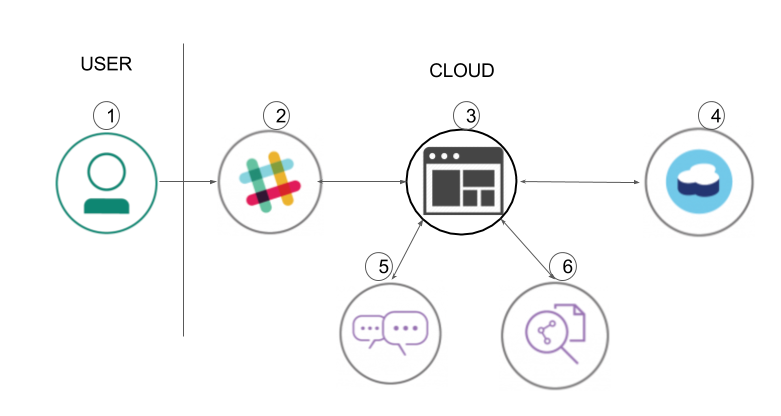

## Flow

1. The user sends a message to the slackbot for online store.
2. Slack sends this message to the running application.
3. The application orchestrates the interactions between the various Watson services.
4. The application queries the Cloudant database for the user's information, including the contents of their shopping cart, and writes the contents back to the database as they change.
5. The application interacts with Watson Assistant to determine which response to send to Slack, and information passed back and forth in the conversation context determines actions within the application.
6. Watson Discovery is used to get information about the items in the online store.

## Included Components

* [Watson Assistant](https://www.ibm.com/watson/developercloud/conversation.html): Create a chatbot with a program that conducts a conversation via auditory or textual methods.
* [Watson Discovery](https://www.ibm.com/watson/developercloud/discovery.html): A cognitive search and content analytics engine for applications to identify patterns, trends, and actionable insights.
* [Cloudant NoSQL DB](https://console.ng.bluemix.net/catalog/services/cloudant-nosql-db): A fully managed data layer designed for modern web and mobile applications that leverages a flexible JSON schema.
* [Slack](https://slack.com): Slack is a cloud-based set of team collaboration tools and services with chat bot integration.

## Featured Technologies

* [Python](https://www.python.org/): Python is a programming language that lets you work more quickly and integrate your systems more effectively.

# Watch the Video

[](https://youtu.be/b-94B3O1czU)

# Steps

**NOTE:** Perform steps 1-7 **OR** click the ``Deploy to IBM Cloud`` button and hit ``Deploy`` and then jump to step 6.

## Deploy to IBM Cloud

[](https://bluemix.net/deploy?repository=https://github.com/IBM/watson-online-store)

> You can use the ``View app`` button to use a simple web UI to chat. For the Slack integration, use your Slack UI to chat after completing the additional [slack configuration](#6-configure-slack). Use the IBM Cloud dashboard to find and manage the app.

## Run locally

1. [Clone the repo](#1-clone-the-repo)
2. [Create IBM Cloud services](#2-create-ibm-cloud-services)
3. [Get IBM Cloud credentials and add to .env](#3-get-ibm-cloud-services-credentials-and-add-to-env-file)
4. [Configure Watson Assistant](#4-configure-watson-assistant-for-business)
5. [Configure Watson Discovery](#5-configure-watson-discovery)
6. [Configure Slack](#6-configure-slack)
7. [Run the application](#7-run-the-application)

### 1. Clone the repo

Clone the `watson-online-store` locally. In a terminal, run:

  `$ git clone https://github.com/ibm/watson-online-store`

We’ll be using the file [`data/workspace.json`](data/workspace.json) and the folder
[`data/ibm_store/`](data/ibm_store)

### 2. Create IBM Cloud services

Create the following services:

  * [**Watson Assistant**](https://console.ng.bluemix.net/catalog/services/conversation)
  * [**Watson Discovery**](https://console.ng.bluemix.net/catalog/services/discovery)
  * [**Cloudant NoSQL DB**](https://console.ng.bluemix.net/catalog/services/cloudant-nosql-db/)

### 3. Get IBM Cloud services Credentials and add to .env file

As you create the IBM Cloud services, you'll need to create service credentials and get the
username and password:


<p align="center">
  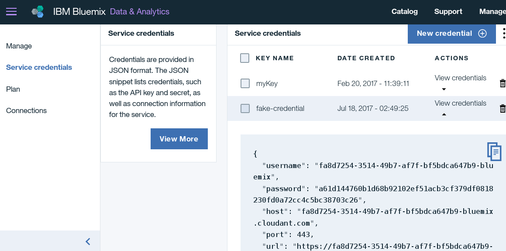
</p>

Move the ``watson-online-store/env.sample`` file to ``/.env`` and populate the service
credentials (and Cloudant URL) as you create the credentials:

```
# Watson conversation
CONVERSATION_USERNAME=<add_conversation_username>
CONVERSATION_PASSWORD=<add_conversation_password>
WORKSPACE_ID=<add_conversation_workspace>

# Cloudant DB
CLOUDANT_USERNAME=<add_cloudant_username>
CLOUDANT_PASSWORD=<add_cloudant_password>
CLOUDANT_DB_NAME=watson_online_store
CLOUDANT_URL=<add_cloudant_url>

# Watson Discovery
DISCOVERY_USERNAME=<add_discovery_username>
DISCOVERY_PASSWORD=<add_discovery_password>
DISCOVERY_URL=<add_discovery_url>
DISCOVERY_ENVIRONMENT_ID=<add_discovery_environment>
DISCOVERY_COLLECTION_ID=<add_discovery_collection>

# Slack
SLACK_BOT_TOKEN=<add_slack_bot_token>
SLACK_BOT_USER=wos
```

### 4. Configure Watson Assistant

Launch the **Watson Assistant** tool. Use the **import** icon button on the right

<p align="center">
  
</p>

Find the local version of [`data/workspace.json`](data/workspace.json) and select
**Import**. Find the **Workspace ID** by clicking on the context menu of the new
workspace and select **View details**.

<p align="center">
  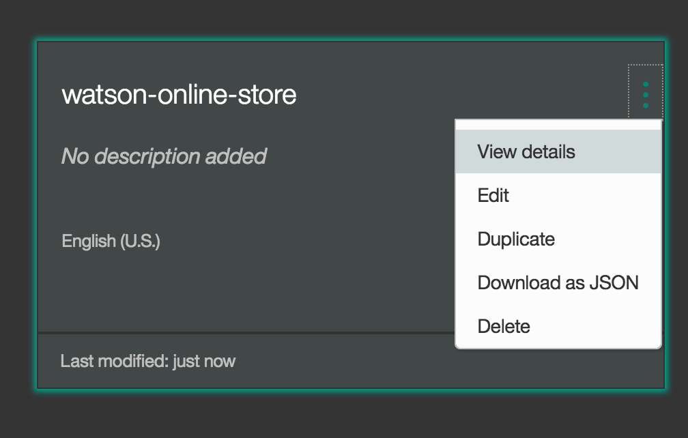
</p>

 Put this Workspace ID into the ``.env`` file
as ``WORKSPACE_ID``.

*Optionally*, to view the conversation dialog select the workspace and choose the
**Dialog** tab, here's a snippet of the dialog:

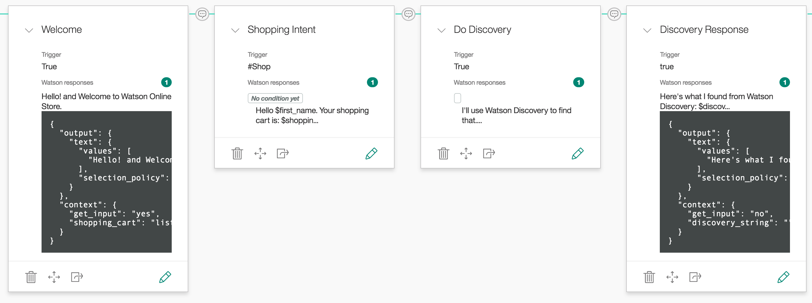

### 5. Configure Watson Discovery

Launch the **Watson Discovery** tool. The first time you do this, you will see
"Before working with private data, we will need to set up your storage". Click `Continue` and
wait for the storage to be set up.
Create a **new data collection** and give the data
collection a unique name.

<p align="center">
  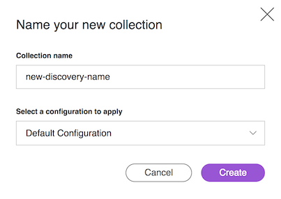
</p>

Seed the content by using either `Drag and drop your documents here` or `browse from your computer`. Choose the JSON files under [`data/ibm_store/`](data/ibm_store).

Under the `Overview` tab, `Collection Info` section, click `Use this collection in API` and copy the `Collection ID` and the `Environment ID` into your `.env` file as `DISCOVERY_COLLECTION_ID` and `DISCOVERY_ENVIRONMENT_ID`.

<p align="center">
  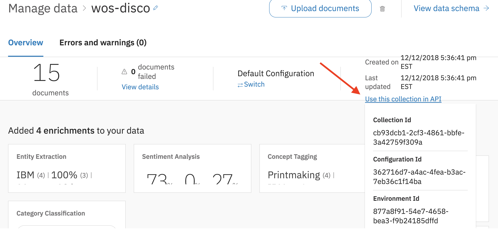
</p>

### 6. Configure Slack

> Note: This Code Pattern includes Slack integration, but if you are only interested in the web UI, you can skip this step.

[Create a slack group](https://slack.com/create) or use an existing one if you
have sufficient authorization. (Refer to [Slack's how-to](https://get.slack.help/hc/en-us/articles/206845317-Create-a-Slack-team)
on creating new groups.) To add a new bot, go to the Slack group’s application settings
by navigating to `https://<slack_group>.slack.com/apps/manage` and selecting the
**Custom Integrations** menu on the left.

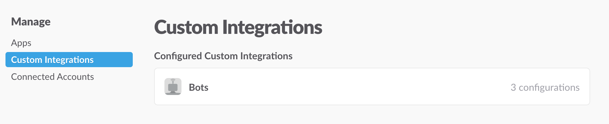

Click on `Bots` and then click the green `Add Configuration` button.

Give the bot a meaningful name. Note that the `@` symbol is pre-populated by Slack
and you do not include that in your `.env` configuration file. Save this in `.env`
as `SLACK_BOT_USER`.

<p align="center">
  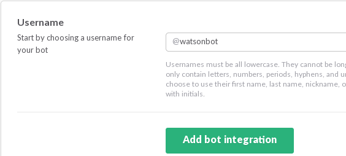
</p>

 Once created save the **API Token** that is generated into the `.env` file
as `SLACK_BOT_TOKEN` if you are running locally, or save this if you are using
Deploy to IBM Cloud.

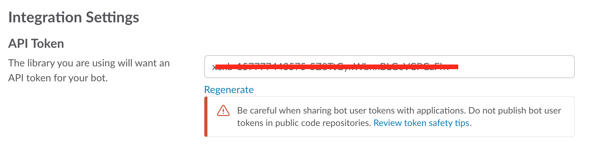

Run `/invite <botame>` in a channel to invite the bot, or message it directly.

<p align="center">
  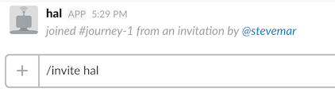
</p>

### 7. Run the application

#### If you used the Deploy to IBM Cloud button...

If you used ``Deploy to IBM Cloud``, most of the setup is automatic, but not
the Slack configuration. For that, we have to update a few environment variables.

In the IBM Cloud dashboard find the App that was created. Click on ``Runtime`` on the menu and navigate to the ``Environment variables`` tab.

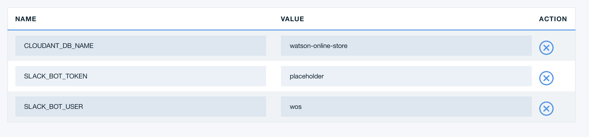

Update the three environment variables:

  * Set ``SLACK_BOT_TOKEN`` to the token you saved in Step 6
  * Set ``SLACK_BOT_USER`` to the name of your bot from Step 6
  * Leave ``CLOUDANT_DB_NAME`` set to ``watson-online-store``

Save the new values and restart the application, watch the logs for errors.

#### If you decided to run the app locally...

```
$ pip install -r requirements.txt
$ python run.py
```

# Sample output

Start a conversation with your bot:

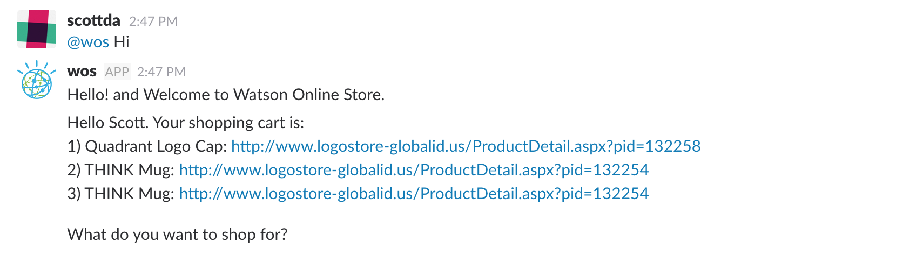

Add an item to your cart:

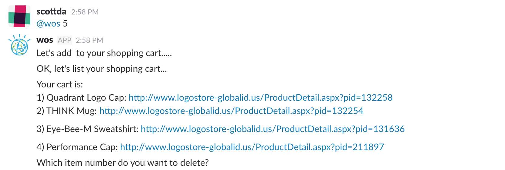

# Troubleshooting

* Help! I'm seeing errors in my log using Deploy to IBM Cloud

This is expected during the first run. The app tries to start before the Discovery
service is fully created. Allow a minute or two to pass, the following message
should appear:

``Watson Online Store bot is connected and running!``

* Large amount of Red Logging info appears.

This is expected. The color for logging in IBM Cloud will be red, regardless of the
nature of the message. The log levels are set to `Debug` to assist the developer
in seeing how the code is executing. This can be changed to ``logging.WARN`` or
``logging.ERROR`` in the [python code](https://github.com/IBM/watson-online-store/blob/master/watsononlinestore/watson_online_store.py#L22).

# Privacy Notice

If using the Deploy to IBM Cloud button some metrics are tracked, the following
information is sent to
[Metrics collector](https://github.com/IBM/metrics-collector-service) service on each deployment:

* Python package version
* Python repository URL
* Application Name (application_name)
* Application GUID (application_id)
* Application instance index number (instance_index)
* Space ID (space_id)
* Application Version (application_version)
* Application URIs (application_uris)
* Cloud Foundry API (cf_api)
* Labels of bound services
* Number of instances for each bound service and associated plan information

This data is collected from the `setup.py` and `repository.yaml` file in the sample application and the ``VCAP_APPLICATION``
and ``VCAP_SERVICES`` environment variables in IBM Cloud and other Cloud Foundry platforms. This
data is used by IBM to track metrics around deployments of sample applications to IBM Cloud to
measure the usefulness of our examples, so that we can continuously improve the content we offer
to you. Only deployments of sample applications that include code to ping the Deployment Tracker
service will be tracked.

## Disabling Deployment Tracking

To disable tracking, simply remove ``cf_deployment_tracker.track()`` and ``metrics_tracker_client.track()`` from the
``run.py`` file in the top level directory.

# Links
* [Demo on Youtube](https://youtu.be/b-94B3O1czU)
* [Watson Assistant](https://www.ibm.com/watson/services/conversation/)
* [Watson Discovery](https://www.ibm.com/watson/services/discovery/)
* [IBM Cloudant db](https://www.ibm.com/cloud/cloudant)
* [Slack](https://slack.com)

# Learn more

* **Artificial Intelligence Code Patterns**: Enjoyed this Code Pattern? Check out our other [AI Code Patterns](https://developer.ibm.com/code/technologies/artificial-intelligence/).
* **AI and Data Code Pattern Playlist**: Bookmark our [playlist](https://www.youtube.com/playlist?list=PLzUbsvIyrNfknNewObx5N7uGZ5FKH0Fde) with all of our Code Pattern videos
* **With Watson**: Want to take your Watson app to the next level? Looking to utilize Watson Brand assets? [Join the With Watson program](https://www.ibm.com/watson/with-watson/) to leverage exclusive brand, marketing, and tech resources to amplify and accelerate your Watson embedded commercial solution.

# License

[Apache 2.0](LICENSE)

