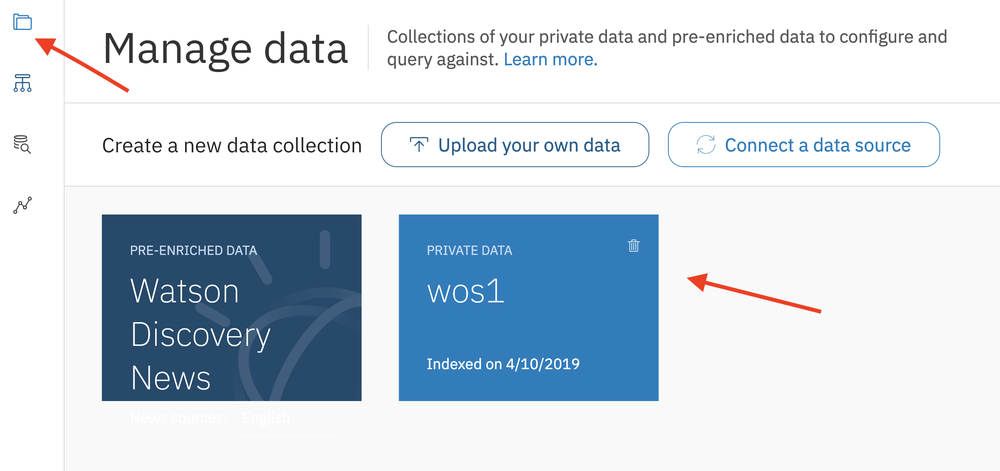

[](https://travis-ci.org/IBM/watson-online-store)

# Creating a Retail Chatbot using Watson Assistant, Discovery and Database Services

*Read this in other languages: [한국어](README_ko.md)*

> Watson Conversation is now Watson Assistant. Although some images in this code pattern may show the service as Watson Conversation, the steps and processes will still work.

In this developer code pattern we will create a Watson Assistant based chatbot
that allows a user to: 1) find items to purchase using Watson Discovery, and
2) add and remove items from their cart by updating a Cloudant NoSQL Database.

When the reader has completed this code pattern, they will understand how to:

* Create a chatbot dialog with Watson Assistant
* Dynamically store and update a Cloudant NoSQL database based on chatbot results
* Seed data into Watson Discovery and leverage its natural language capabilities
* Manage and customize a Slack group to add a chatbot


## Flow

1. The user sends a message to the slackbot for online store.
2. Slack sends this message to the running application.
3. The application orchestrates the interactions between the various Watson services.
4. The application queries the Cloudant database for the user's information, including the contents of their shopping cart, and writes the contents back to the database as they change.
5. The application interacts with Watson Assistant to determine which response to send to Slack, and information passed back and forth in the conversation context determines actions within the application.
6. Watson Discovery is used to get information about the items in the online store.

## Included Components

* [Watson Assistant](https://www.ibm.com/cloud/watson-assistant): Create a chatbot with a program that conducts a conversation via auditory or textual methods.
* [Watson Discovery](https://www.ibm.com/watson/services/discovery/): A cognitive search and content analytics engine for applications to identify patterns, trends, and actionable insights.
* [Cloudant NoSQL DB](https://www.ibm.com/cloud/cloudant): A fully managed data layer designed for modern web and mobile applications that leverages a flexible JSON schema.
* [Slack](https://slack.com): Slack is a cloud-based set of team collaboration tools and services with chat bot integration.

## Featured Technologies

* [Python](https://www.python.org/): Python is a programming language that lets you work more quickly and integrate your systems more effectively.

# Watch the Video

[](https://youtu.be/b-94B3O1czU)

# Steps

**NOTE:** Perform steps 1-7 **OR** click the ``Deploy to IBM Cloud`` button and hit ``Deploy`` and then jump to step 6.

**NOTE:** The Watson Discovery service is not available in the `London` region, so this application will require deployment in one of the other IBM Cloud regions.

## Deploy to IBM Cloud

[](https://cloud.ibm.com/devops/setup/deploy?repository=https://github.com/IBM/watson-online-store)

If you encounter deployment errors, refer to [Troubleshooting](#troubleshooting).

> You can use the ``View app`` button to use a simple web UI to chat. For the Slack integration, use your Slack UI to chat after completing the additional [slack configuration](#6-configure-slack). Use the IBM Cloud dashboard to find and manage the app.

## Run locally

1. [Clone the repo](#1-clone-the-repo)
2. [Create IBM Cloud services](#2-create-ibm-cloud-services)
3. [Get IBM Cloud credentials and add to .env](#3-get-ibm-cloud-services-credentials-and-add-to-env-file)
4. [Configure Watson Assistant](#4-configure-watson-assistant)
5. [Configure Watson Discovery](#5-configure-watson-discovery)
6. [Configure Slack](#6-configure-slack)
7. [Run the application](#7-run-the-application)

### 1. Clone the repo

Clone the `watson-online-store` locally. In a terminal, run:

```bash
git clone https://github.com/ibm/watson-online-store
```

We’ll be using the file [`data/workspace.json`](data/workspace.json) and the folder
[`data/ibm_store/`](data/ibm_store)

### 2. Create IBM Cloud services

Create the following services:

* [**Watson Assistant**](https://cloud.ibm.com/catalog/services/conversation)
* [**Watson Discovery**](https://cloud.ibm.com/catalog/services/discovery)
* [**Cloudant NoSQL DB**](https://cloud.ibm.com/catalog/services/cloudant)

### 3. Get IBM Cloud services Credentials and add to .env file

As you create the IBM Cloud services, you'll need to create service credentials and get the
username and password:


Copy the ``watson-online-store/env.sample`` file to ``watson-online-store/.env`` and populate the service
credentials and URLs as you create the credentials:

```bash
# Copy this file to .env and replace the credentials with
# your own before running run.py.

# Watson Assistant
WORKSPACE_ID=<add_assistant_workspace>
ASSISTANT_URL=<add_assistant_url>
## Un-comment and use either username+password or IAM apikey.
# ASSISTANT_USERNAME=<add_assistant_username>
# ASSISTANT_PASSWORD=<add_assistant_password>
# ASSISTANT_IAM_APIKEY=<add_assistant_apikey>

# Cloudant DB
CLOUDANT_USERNAME=<add_cloudant_username>
CLOUDANT_PASSWORD=<add_cloudant_password>
CLOUDANT_DB_NAME=watson_online_store
CLOUDANT_URL=<add_cloudant_url>

# Watson Discovery
DISCOVERY_URL=<add_discovery_url>
DISCOVERY_ENVIRONMENT_ID=<add_discovery_environment>
DISCOVERY_COLLECTION_ID=<add_discovery_collection>
## Un-comment and use either username+password or IAM apikey.
# DISCOVERY_USERNAME=<add_discovery_username>
# DISCOVERY_PASSWORD=<add_discovery_password>
# DISCOVERY_IAM_APIKEY=<add_discovery_apikey>

# Slack
SLACK_BOT_TOKEN=<add_slack_bot_token>
SLACK_BOT_USER=wos
```

### 4. Configure Watson Assistant

#### Import the Assistant workspace.json

* Find the Assistant service in your IBM Cloud Dashboard.
* Click on the service and then click on `Launch tool`.
* Go to the `Skills` tab.
* Click `Create new`
* Click the `Import skill` tab.
* Click `Choose JSON file`, go to your cloned repo dir, and `Open` the workspace.json file in [`data/workspace.json`](data/workspace.json).
* Select `Everything` and click `Import`.

To find the `WORKSPACE_ID` for Watson Assistant:

* Go back to the `Skills` tab.
* Find the card for the workspace you would like to use. Look for `watson-online-store`.
* Click on the three dots in the upper right-hand corner of the card and select `View API Details`.
* Copy the `Workspace ID` GUID. Save it for the .env file


*Optionally*, to view the conversation dialog select the workspace and choose the
**Dialog** tab, here's a snippet of the dialog:


### 5. Configure Watson Discovery

Launch the **Watson Discovery** tool.
wait for the storage to be set up.
Create a **new data collection** by clicking `Upload your own data`
Discovery will setup your storage. (You may be invited to upgrade for production quality, but you will be able to use this code pattern with the free trial version).


Seed the content by using either `Drag and drop your documents here` or `browse from your computer`. Choose the JSON files under [`data/ibm_store/`](data/ibm_store).

Click on the left menu `Manage Data` icon and then click your newly created Data collection:



Under the `Overview` tab, `Collection Info` section, click `Use this collection in API` and copy the `Collection ID` and the `Environment ID` into your `.env` file as `DISCOVERY_COLLECTION_ID` and `DISCOVERY_ENVIRONMENT_ID`.


### 6. Configure Slack

> Note: This code pattern includes Slack integration, but if you are only interested in the web UI, you can skip this step.

[Create a slack group](https://slack.com/create) or use an existing one if you
have sufficient authorization. (Refer to [Slack's how-to](https://get.slack.help/hc/en-us/articles/206845317-Create-a-Slack-team)
on creating new groups.) To add a new bot, go to the Slack group’s application settings
by navigating to `https://<slack_group>.slack.com/apps/manage` and selecting the
**Custom Integrations** menu on the left.


Click on `Bots` and then click the green `Add Configuration` button.

Give the bot a meaningful name. Note that the `@` symbol is pre-populated by Slack
and you do not include that in your `.env` configuration file. Save this in `.env`
as `SLACK_BOT_USER`.


 Once created save the **API Token** that is generated into the `.env` file
as `SLACK_BOT_TOKEN` if you are running locally, or save this if you are using
Deploy to IBM Cloud.


Run `/invite <botame>` in a channel to invite the bot, or message it directly.


### 7. Run the application

#### If you used the Deploy to IBM Cloud button...

If you used ``Deploy to IBM Cloud``, most of the setup is automatic, but not
the Slack configuration. For that, we have to update a few environment variables.

In the IBM Cloud dashboard find the App that was created. Click on ``Runtime`` on the menu and navigate to the ``Environment variables`` tab.


Update the three environment variables:

* Set ``SLACK_BOT_TOKEN`` to the token you saved in Step 6
* Set ``SLACK_BOT_USER`` to the name of your bot from Step 6
* Leave ``CLOUDANT_DB_NAME`` set to ``watson-online-store``

Save the new values and restart the application, watch the logs for errors.

#### If you decided to run the app locally...

The general recommendation for Python development is to use a virtual environment [(venv)](https://docs.python.org/3/tutorial/venv.html). To install and initialize a virtual environment, use the `venv` module on Python 3 (you install the virtualenv library for Python 2.7):

```bash
# Create the virtual environment using Python. Use one of the two commands depending on your Python version.
# Note, it may be named python3 on your system.

$ python -m venv mytestenv       # Python 3.X
$ virtualenv mytestenv           # Python 2.X

# Now source the virtual environment. Use one of the two commands depending on your OS.

$ source mytestenv/bin/activate  # Mac or Linux
$ ./mytestenv/Scripts/activate   # Windows PowerShell
```

Now go to the cloned repo directory:

```bash
cd watson-online-store
```

Install the Python requirements for this code pattern. Run:

```bash
pip install -r requirements.txt
```

> **TIP** :bulb: To terminate the virtual environment use the `deactivate` command.

Finally, run the application:

```bash
python run.py
```

# Sample output

Start a conversation with your bot:


Add an item to your cart:


# Troubleshooting

* Error deploying to IBM Cloud:

  

  This indicates that the Discovery service is still being provisioned. Wait a few minutes and click the `Run` button to restart the application.

* Large amount of Red Logging info appears.

  This is expected. The color for logging in IBM Cloud will be red, regardless of the nature of the message. The log levels are set to `Debug` to assist the developer in seeing how the code is executing. This can be changed to ``logging.WARN`` or ``logging.ERROR`` in the [python code](https://github.com/IBM/watson-online-store/blob/master/watsononlinestore/watson_online_store.py#L22).

# Links

* [Demo on Youtube](https://youtu.be/b-94B3O1czU)
* [Watson Assistant](https://www.ibm.com/cloud/watson-assistant/)
* [Watson Discovery](https://www.ibm.com/watson/services/discovery/)
* [IBM Cloudant db](https://www.ibm.com/cloud/cloudant)
* [Slack](https://slack.com)

# Learn more

* **Artificial Intelligence Code Patterns**: Enjoyed this code pattern? Check out our other [AI code patterns](https://developer.ibm.com/patterns/category/artificial-intelligence/).
* **AI and Data Code Pattern Playlist**: Bookmark our [playlist](https://www.youtube.com/playlist?list=PLzUbsvIyrNfknNewObx5N7uGZ5FKH0Fde) with all of our code pattern videos
* **With Watson**: Want to take your Watson app to the next level? Looking to utilize Watson Brand assets? [Join the With Watson program](https://www.ibm.com/watson/with-watson/) to leverage exclusive brand, marketing, and tech resources to amplify and accelerate your Watson embedded commercial solution.

# License

This code pattern is licensed under the Apache License, Version 2. Separate third-party code objects invoked within this code pattern are licensed by their respective providers pursuant to their own separate licenses. Contributions are subject to the [Developer Certificate of Origin, Version 1.1](https://developercertificate.org/) and the [Apache License, Version 2](https://www.apache.org/licenses/LICENSE-2.0.txt).

[Apache License FAQ](https://www.apache.org/foundation/license-faq.html#WhatDoesItMEAN)
