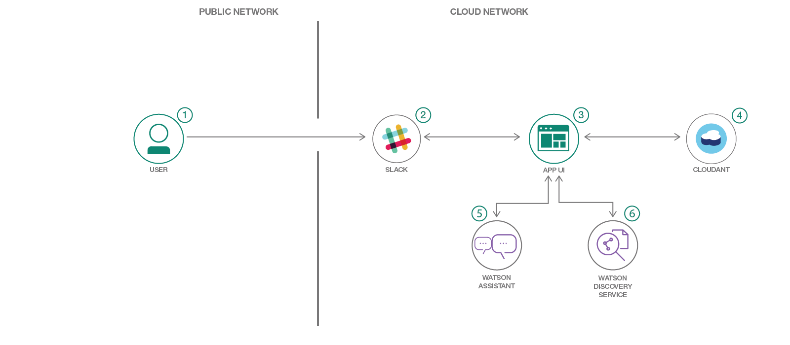
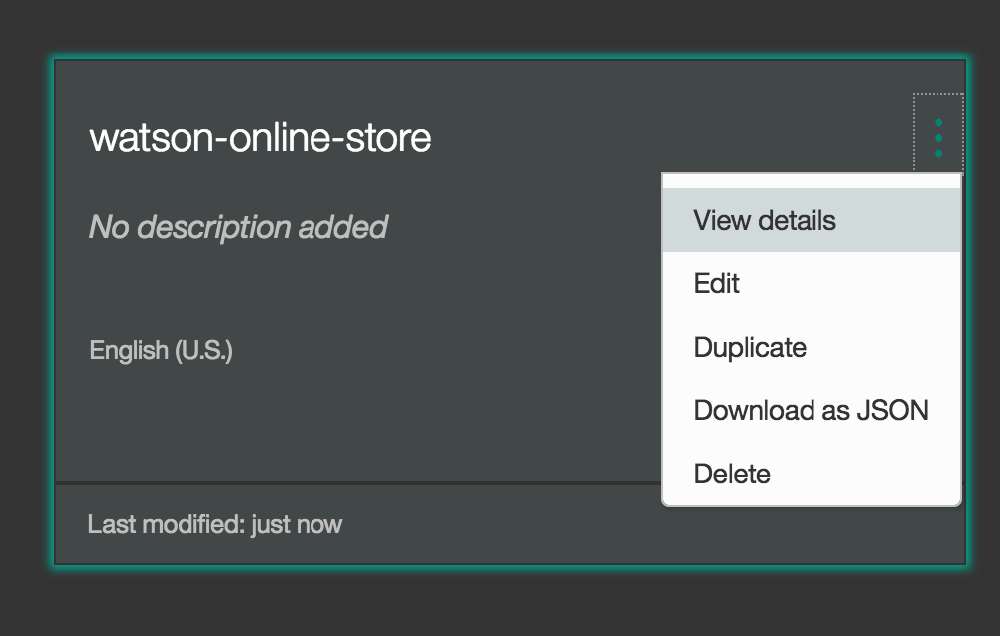

[](https://travis-ci.org/IBM/watson-online-store)


# Watson Assistant for Business, Discovery, 데이터베이스 서비스를 이용한 대화형 커머스 챗봇 만들기

이 개발과정에서 우리는 Watson Assistant for Business 기반 챗봇을 만들게 됩니다. 사용자들은 이 챗봇으로 1) Watson Discovery를 이용해 구매할 품목을 검색하고 2) Cloudant NoSQL 데이터베이스를 업데이트해 장바구니에 품목을 추가하거나 삭제할 수 있습니다.

독자가 이 개발과정을 마치면, 아래의 방법들을 이해하게 될 것입니다.

* Watson Assistant for Business으로 챗봇 대화 생성하기
* 챗봇 결과를 토대로 Cloudant NoSQL 데이터베이스에 동적으로 저장하고 업데이트하기
* Watson Discovery에 데이터를 학습시키고 자연어 기능을 활용하기
* 챗봇에 추가되는 Slack그룹 관리와 커스터마이징



### With Watson

Watson 애플리케이션의 다음 레벨로 넘어가고 싶으신가요? Watson 브랜드 자산을 활용하고 싶으신가요?  독점적 브랜드, 마케팅, 기술 리소스를 제공하는 [With Watson](https://www.ibm.com/watson/with-watson) 프로그램에 참여하시면 Watson을 활용한 여러분의 상용 솔루션의 가치를 높일 수 있습니다.

## 포함된 구성요소
- Bluemix Watson Assistant for Business
- Bluemix Watson Discovery
- Bluemix Cloudant NoSQL DB
- Slack
- Python

# 비디오 보기

[](https://youtu.be/b-94B3O1czU)

# 단계

**참고:** 1-6단계를 실행  **또는**  ``Deploy to Bluemix`` 버튼을 클릭하고 ``Create`` 을 눌러 5단계로 이동합니다.

> (Slack만 있고) 별도 웹 UI가 없기 때문에 애플리케이션을 확인할 때 ``View app`` 버튼을 사용하지 않도록 합니다. Bluemix 대시보드를 활용해 애플리케이션을 검색하고 관리합니다. 채팅을 하시려면 Slack UI를 사용하세요.


[](https://bluemix.net/deploy?repository=https://github.com/IBM/watson-online-store&cm_mmc=github-code-_-native-_-retailchatbot-_-deploy2bluemix)

1. [GitHub저장소 복제하기](#1-저장소-복제하기)
2. [Bluemix 서비스 생성하기](#2-bluemix-서비스-생성하기)
3. [Watson Assistant for Business 구성하기](#3-watson-conversation-구성하기)
4. [Watson Discovery 구성하기](#4-watson-discovery-구성하기)
5. [Slack 구성하기](#5-slack-구성하기)
6. [애플리케이션 실행하기](#6-애플리케이션-실행하기)

## 1. 저장소 복제하기

로컬에서 `watson-online-store` 을 복제합니다.  터미널에서 다음을 실행합니다.

  `$ git clone https://github.com/ibm/watson-online-store`

파일은 [`data/workspace.json`](data/workspace.json),폴더는
[`data/ibm_store_html/`](data/ibm_store_html)을 사용합니다.

## 2. Bluemix 서비스 생성하기

다음의 서비스를 생성합니다.

  * [**Watson Assistant for Business**](https://console.ng.bluemix.net/catalog/services/conversation)
  * [**Watson Discovery**](https://console.ng.bluemix.net/catalog/services/discovery)
  * [**Cloudant NoSQL DB**](https://console.ng.bluemix.net/catalog/services/cloudant-nosql-db/)

## 3. Watson Assistant for Business 구성하기

 **Watson Assistant for Business** 툴을 실행합니다.  오른편에 있는  **import** 아이콘 버튼을 사용합니다.

<p align="center">
  
</p>

[`data/workspace.json`](data/workspace.json) 의 로컬 버전을 검색하여
**Import** 를 선택합니다. 새로운 workspace에서 상황에 맞는 메뉴를 클릭해  **Workspace ID** 를 찾고  **View details** 를 선택합니다. 나중을 위해 이ID를 저장합니다

<p align="center">
  
</p>

옵션으로 대화 dialog를 보시려면workspace를 선택하고
**Dialog** 탭을 선택합니다. dialog의 일부 모습은 이렇습니다.


## 4. Watson Discovery 구성하기

 **Watson Discovery** 툴을 실행합니다.  **new data collection** 을 생성하고 고유한 이름을 지정합니다.

<p align="center">
  
</p>

이 dialog에서  **Add data to this collection** 을 선택하여
[`data/ibm_store_html/`](data/ibm_store_html)에 있는 HTML 파일들을 선택하여 컨텐츠를 추가합니다. 선택이 완료되면  **environment_id** 와 **collection_id** 를 저장합니다.

<p align="center">
  
</p>

## 5. Slack 구성하기

[슬랙 그룹을 생성하거나](https://slack.com/create) 충분한 권한이 있다면 기존의 그룹을 이용합니다 . (신규 그룹 생성에 대해서 알아보시려면 [Slack's how-to](https://get.slack.help/hc/en-us/articles/206845317-Create-a-Slack-team)
참조.) 새로운 bot을 추가하려면 `https://<slack_group>.slack.com/apps/manage` 로 이동한 후 왼편에 있는
**Custom Integrations** 메뉴를 선택하여 Slack 그룹 애플리케이션 설정으로 들어갑니다.


bot에 재미있는 이름을 지정하고 생성이 완료되면 생성된  **API Token** 을 저장합니다.


 bot을 초대하거나 직접 메시지를 보내려면 채널에서`/invite <botame>` 을 실행합니다.

<p align="center">
  
</p>

## 6. 애플리케이션 실행하기

### Deploy to Bluemix 버튼을 사용한다면...

 ``Deploy to Bluemix``을 사용하면 대부분의 설정이 자동으로 진행되지만 전부 다 자동인 것은 아닙니다. 일부 환경변수를 업데이트해야 합니다.

Bluemix 대시보드에서 생성된 앱을 찾습니다. 메뉴에서  ``Runtime`` 을 클릭하고  ``Environment variables`` 탭으로 이동합니다..


다음과 같이 세 가지 환경변수를 업데이트 합니다.

  *  ``SLACK_BOT_TOKEN`` 값으로 5단계에서 저장한 토큰을 지정합니다.
  *  ``SLACK_BOT_USER`` 에 bot 이름을 설정합니다.
  *  ``CLOUDANT_DB_NAME`` 을 ``watson-online-store``에 설정된 상태로 두어도 괜찮을 것입니다.

새로운 값을 저장하고 애플리케이션을 재시작한 후 에러가 있는지 로그를 살펴봅니다.

### 앱을 로컬에서 실행하기로 결정했다면...

 [`env.sample`](env.sample) 을 `.env`,로 복사하고,  필요한 ID로 수정한 후 애플리케이션을 실행합니다.

각 서비스의  `USERNAME`, `PASSWORD`,  `URL` 설정은 BlueMix에 있는
 `Service Credentials` 탭에서 얻을 수 있습니다. 그 외 설정은 이전 구성 단계에서 수집되었습니다.

```
$ cp env.sample .env
### edit .env
$ python run.py
```

# 샘플 출력

아래와 같이 여러분이 만든bot과 대화를 시작합니다.


아래와 같이 장바구니에 품목을 추가합니다.


# 문제해결

* •	도와주세요! 제 로그에 에러가 있습니다.

첫 번째 실행에서 일어날 수 있는 문제입니다. Discovery 서비스가 완전히 생성되기 전에 앱이 시작되려고 합니다. 1-2분이 경과하도록 두면 아래의 메시지가 나타납니다.

``Watson Online Store bot is connected and running!``

* •	로컬 실행을 위한 환경변수 설정하기

> 참고: 애플리케이션이 로컬에서 실행되는 경우에만 필요한 설정입니다.

Bluemix 서비스 (Assistant for Business, Cloudant, and Discovery)에 대한 신임정보는 Bluemix의  ``Services``메뉴에서  ``Service Credentials``옵션을 선택하면 찾아볼 수 있습니다

```
# Watson conversation
CONVERSATION_USERNAME=<add_conversation_username>
CONVERSATION_PASSWORD=<add_conversation_password>
WORKSPACE_ID=<add_conversation_workspace>

# Cloudant DB
CLOUDANT_USERNAME=<add_cloudant_username>
CLOUDANT_PASSWORD=<add_cloudant_password>
CLOUDANT_DB_NAME=watson_online_store
CLOUDANT_URL=<add_cloudant_url>

# Watson Discovery
DISCOVERY_USERNAME=<add_discovery_username>
DISCOVERY_PASSWORD=<add_discovery_password>
DISCOVERY_ENVIRONMENT_ID=<add_discovery_environment>
DISCOVERY_COLLECTION_ID=<add_discovery_collection>

# Slack
SLACK_BOT_TOKEN=<add_slack_bot_token>
SLACK_BOT_USER=wos
```

# 라이센스

[Apache 2.0](LICENSE)

# 개인정보 보호정책

Deploy to Bluemix버튼을 사용하면 몇몇 항목은 추적이 되는데, 배포시 아래의 정보가  [Deployment Tracker](https://github.com/IBM-Bluemix/cf-deployment-tracker-service) 서비스로 전송됩니다.

* Python package version
* Python repository URL
* Application Name (application_name)
* Application GUID (application_id)
* Application instance index number (instance_index)
* Space ID (space_id)
* Application Version (application_version)
* Application URIs (application_uris)
* Labels of bound services
* Number of instances for each bound service and associated plan information

이 데이터는 샘플 애플리케이션의 setup.py 파일 및 IBM Bluemix와 여타 Cloud Foundry 플랫폼의  ``VCAP_APPLICATION``
과 ``VCAP_SERVICES``환경 변수로부터 수집됩니다. IBM은 해당 데이터를 제공된 예제의 유용한 정도를 가늠하여 지속적으로 개발자 여러분들께 제공하는 컨텐츠를 개선하고자 IBM Bluemix의 샘플 애플리케이션의 개발 관련 항목들을 추적 관찰하고 있습니다. Deployment Tracker서비스를 호출하기 위한 코드가 있는 샘플 애플리케이션만 배포시 추적됩니다.

## 배포 추적 비활성화하기

최상위 디렉토리의 run.py 파일에서  ``cf_deployment_tracker.track()`` 을 제거하여 배포 추적을 비활성화 할 수 있습니다.
